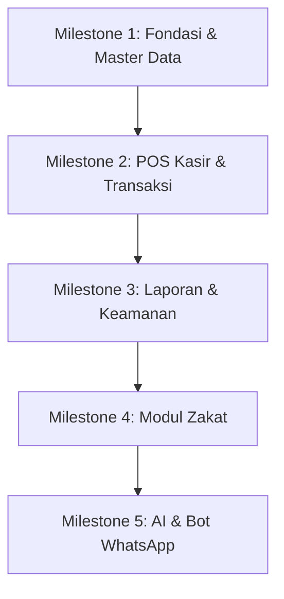

# 9. BACKLOG.md — Maheer Fashion POS

> **Dokumen Backlog Produk, Prioritas, & Milestone**  
> Sistem Point of Sale & Manajemen Inventaris berbasis web untuk bisnis fashion omni-channel.
> 
> **Status:** Draft | **Versi:** 1.0.0 | **Tanggal:** 22 Mei 2026  
> **Audiens:** Product Owner, Developer, QA, & Stakeholder

---

## Daftar Isi

1. [Gambaran Umum](#1-gambaran-umum)
2. [Fase Rilis & Milestone](#2-fase-rilis--milestone)
3. [Panduan Estimasi & Skala Prioritas](#3-panduan-estimasi--skala-prioritas)
4. [Definition of Done (DoD)](#4-definition-of-done-dod)
5. [Daftar Backlog Produk (Product Backlog)](#5-daftar-backlog-produk-product-backlog)
   - [Modul 1: Autentikasi & Otorisasi (AUTH)](#modul-1-autentikasi--otorisasi-auth)
   - [Modul 2: Point of Sale & Kasir (POS)](#modul-2-point-of-sale--kasir-pos)
   - [Modul 3: Manajemen Inventaris (INV)](#modul-3-manajemen-inventaris-inv)
   - [Modul 4: Dashboard & Analitik (DASH)](#modul-4-dashboard--analitik-dash)
   - [Modul 5: Laporan & Audit (REP)](#modul-5-laporan--audit-rep)
   - [Modul 6: Modul Zakat & Lembaga (ZKT)](#modul-6-modul-zakat--lembaga-zkt)
   - [Modul 7: Fitur Pintar AI & WhatsApp Bot (AI)](#modul-7-fitur-pintar-ai--whatsapp-bot-ai)
   - [Modul 8: Infrastruktur & Keamanan (INF)](#modul-8-infrastruktur--keamanan-inf)
6. [Catatan Perubahan (Changelog)](#6-catatan-perubahan-changelog)

---

## 1. Gambaran Umum

Dokumen ini menyajikan seluruh daftar kebutuhan sistem (*product backlog*) untuk **Maheer Fashion POS** yang disusun berdasarkan hasil sintesis dari seluruh dokumen spesifikasi yang ada di folder `docs`:
- [PRD_Maheer_Fashion_POS.md](./PRD_Maheer_Fashion_POS.md) (Persyaratan Produk)
- [2.ARCHITECTURE.md](./2.ARCHITECTURE.md) (Arsitektur & Skema Database)
- [3.COMPLIANCE.md](./3.COMPLIANCE.md) (Kebijakan Audit & KYC/AML)
- [4.AISPEC.md](./4.AISPEC.md) (Spesifikasi AI & WhatsApp Bot)
- [5.DEVGUIDE.md](./5.DEVGUIDE.md) (Panduan Coding & Testing)
- [6.SECURITY.md](./6.SECURITY.md) (Keamanan & Incident Response)
- [7.BUSINESS_RULES.md](./7.BUSINESS_RULES.md) (Aturan Bisnis & Alur Kerja)
- [8.UI_GUIDELINES.md](./8.UI_GUIDELINES.md) (Panduan Desain Antarmuka)

Backlog ini dirancang untuk menjadi **single source of truth** bagi tim developer dalam merencanakan sprint, memprioritaskan fitur, serta melacak progres implementasi hingga rilis produksi.

---

## 2. Fase Rilis & Milestone

Pengembangan aplikasi dibagi ke dalam **5 Milestone Utama** secara bertahap:

### 🏁 Milestone 1: Fondasi Sistem & CRUD Produk (Status: Selesai / Dalam Proses)
- **Fokus:** Integrasi Next.js 14 App Router, konfigurasi Supabase Client & Local Setup, Autentikasi dasar (email/password), skema database awal (`users` dan `products`), dan CRUD Produk dasar.
- **Tujuan:** Sistem dapat diakses secara lokal dengan visualisasi dasar untuk manajemen produk.

### 🛒 Milestone 2: POS Kasir & Transaksi (Status: Sedang Dikerjakan)
- **Fokus:** Modul POS Kasir, antarmuka keranjang belanja, pencarian cepat produk, pilihan saluran penjualan (Offline/Shopee/TikTok Shop), serta pemrosesan transaksi atomik (stok otomatis berkurang).
- **Tujuan:** Kasir dapat melakukan proses checkout secara penuh dan mencatat penjualan ke database secara real-time.

### 📊 Milestone 3: Laporan, Dashboard, & Kontrol Keamanan (Status: Belum Dikerjakan)
- **Fokus:** Visualisasi Dashboard Analitik (Recharts), ringkasan KPI Owner, riwayat laporan penjualan, ekspor data CSV, pembatasan hak akses via Row Level Security (RLS) di database, serta logging aktivitas di tabel `audit_logs`.
- **Tujuan:** Owner dapat memantau keuntungan secara real-time dengan sistem keamanan berlapis.

### 🕌 Milestone 4: Modul Zakat & Verifikasi Lembaga (Status: Belum Dikerjakan)
- **Fokus:** Perhitungan Zakat Perniagaan otomatis (2.5% dari profit bersih), modul pendaftaran masjid/lembaga zakat, alur verifikasi menggunakan *Prinsip Empat Mata (Four-Eyes)*, dan pencatatan distribusi zakat.
- **Tujuan:** Memfasilitasi tanggung jawab sosial bisnis secara akuntabel langsung di dalam sistem POS.

### 🤖 Milestone 5: Fitur Pintar AI & WhatsApp Bot (Status: Belum Dikerjakan)
- **Fokus:** Integrasi OCR Google Vision API & Tesseract.js (scan nota supplier & struk pembayaran), LLM parser untuk prefill data restock, WhatsApp Bot untuk notifikasi otomatis (stok rendah/transaksi besar) dan query interaktif admin.
- **Tujuan:** Mengotomatiskan tugas operasional berulang dan menghadirkan asisten virtual bagi Owner.

---

## 3. Panduan Estimasi & Skala Prioritas

Setiap backlog item diberikan label Prioritas dan Estimasi Kompleksitas:

### Skala Prioritas
- 🔴 **P1 (Critical):** Fitur inti yang mutlak dibutuhkan agar sistem berjalan. Tanpa fitur ini, aplikasi tidak dapat digunakan (Blocker).
- 🟡 **P2 (High):** Fitur penting untuk kebutuhan bisnis sehari-hari, keamanan data sensitif, atau pemenuhan aturan hukum (Compliance).
- 🔵 **P3 (Medium):** Fitur penunjang yang meningkatkan efisiensi operasional atau kemudahan penggunaan (UX).
- 🟢 **P4 (Low):** Fitur opsional atau kosmetik yang bersifat *nice-to-have* (bisa ditunda tanpa memengaruhi operasional).

### Estimasi (Story Points - SP)
Menggunakan deret Fibonacci untuk mengukur kompleksitas tugas (bukan durasi waktu):
- **1 SP:** Perubahan minor (perubahan teks, tweak CSS, update konfigurasi).
- **2 SP:** Tugas sederhana dengan alur jelas (komponen UI stateless, helper utility).
- **3 SP:** Tugas menengah (CRUD standar, query database tunggal, validasi form standar).
- **5 SP:** Tugas kompleks (multi-tabel transactions, integrasi API pihak ketiga, kustomisasi chart, setup RLS database).
- **8 SP:** Tugas sangat kompleks (memiliki risiko regresi tinggi, alur persetujuan multi-user, integrasi AI dengan parsing data non-deterministik).

---

## 4. Definition of Done (DoD)

Backlog item baru dinyatakan **SELESAI (Done)** jika telah memenuhi kriteria berikut:
1. **Fungsionalitas:** Fitur bekerja sesuai dengan *Acceptance Criteria* yang tertera pada user story.
2. **Kualitas Kode:**
   - Tidak ada error kompilasi TypeScript (lolos strict mode).
   - Seluruh variabel didefinisikan tipenya (tidak ada tipe `any`).
   - Kode lulus uji linting (`npm run lint`) dan terformat rapi (`npm run format`).
3. **Keamanan:** RLS Policy pada tabel Supabase yang termodifikasi telah teruji aman.
4. **Pengujian:**
   - Semua unit test yang terkait berhasil dijalankan (`npm run test`).
   - E2E test kritis (jika ada) berhasil dijalankan (`npm run test:e2e`).
5. **Deployment:** Kode berhasil di-build dan di-deploy ke environment Staging/Preview Vercel tanpa error.
6. **Dokumentasi:** Menulis riwayat perubahan pada berkas `CHANGELOG.md` apabila ada pembaruan API atau skema database.

---

## 5. Daftar Backlog Produk (Product Backlog)

### Modul 1: Autentikasi & Otorisasi (AUTH)

| ID | Nama Fitur / Tugas | User Story / Deskripsi | Kriteria Penerimaan (Acceptance Criteria) | Prioritas | Est (SP) | Referensi Dokumen | Status |
| :--- | :--- | :--- | :--- | :---: | :---: | :--- | :---: |
| **AUTH-01** | Registrasi Akun Pengguna Baru | Sebagai Admin, saya ingin mendaftarkan email & nama staf baru dengan peran tertentu agar mereka memiliki hak masuk ke sistem. | - Tersedia form input email, nama lengkap, dan dropdown role (Admin / Kasir). - Sistem mengirimkan email undangan onboarding via Supabase Auth. - Mencegah pendaftaran email duplikat. | 🔴 P1 | 3 | PRD 7.1, BR-ROLE-04, DEV 5.1 | `Done` |
| **AUTH-02** | Login Pengguna terdaftar | Sebagai Pengguna, saya ingin masuk ke dalam sistem menggunakan email dan password agar dapat melakukan aktivitas sesuai peran saya. | - Form menampilkan kolom email & password dengan validasi format email. - Login gagal menampilkan pesan error spesifik dan aman. - Redirect ke halaman yang sesuai setelah login (Admin -> Dashboard, Kasir -> POS). | 🔴 P1 | 3 | PRD 7.1, SEC 1.2, SEC 1.3 | `Done` |
| **AUTH-03** | Manajemen Sesi & Auto-Logout | Sebagai Tim Keamanan, saya ingin sesi pengguna berakhir otomatis setelah 30 menit tidak aktif agar akun tidak disalahgunakan ketika perangkat ditinggalkan. | - Sesi disimpan dalam HttpOnly Cookie (Server-Side). - Token JWT kedaluwarsa setelah 1 jam (dengan rotasi refresh token otomatis). - Sistem melakukan logout otomatis jika tidak ada aktivitas user selama 30 menit. | 🟡 P2 | 3 | SEC 1.2 | `Done` |
| **AUTH-04** | Kebijakan Kekuatan Password | Sebagai Tim Keamanan, saya ingin menerapkan kebijakan password yang kuat saat registrasi / ganti password untuk menghindari serangan brute force. | - Password minimal 8 karakter, wajib memiliki minimal 1 huruf besar, 1 huruf kecil, dan 1 angka. - Password tidak boleh sama dengan 3 password terakhir (saat ganti password). | 🟡 P2 | 2 | SEC 1.3 | `Done` |
| **AUTH-05** | Pengaturan Pegawai oleh Admin | Sebagai Admin, saya ingin menonaktifkan akun staf atau mengganti peran mereka agar dapat menjaga akses operasional toko. | - Halaman kelola staf hanya dapat diakses oleh Admin. - Admin dapat mengubah status akun (`is_active = false`) atau merubah role. - Akun Admin terakhir di sistem tidak dapat dinonaktifkan / dihapus (BR-ROLE-04). | 🔴 P1 | 3 | PRD 7.1, BR-ROLE-02, BR-ROLE-04 | `Done` |
| **AUTH-06** | Keamanan Data Database (RLS) | Sebagai Tim Keamanan, saya ingin mengaktifkan Row Level Security (RLS) di PostgreSQL agar kasir hanya bisa mengakses data transaksinya sendiri. | - RLS aktif di tabel `users`, `products`, `transactions`, dan `transaction_details`. - Kebijakan (Policy) membatasi kasir hanya bisa SELECT produk aktif (`is_active = true`) dan transaksi miliknya sendiri. | 🟡 P2 | 5 | ARCH 3.3, SEC 1.4 | `Done` |

---

### Modul 2: Point of Sale & Kasir (POS)

| ID | Nama Fitur / Tugas | User Story / Deskripsi | Kriteria Penerimaan (Acceptance Criteria) | Prioritas | Est (SP) | Referensi Dokumen | Status |
| :--- | :--- | :--- | :--- | :---: | :---: | :--- | :---: |
| **POS-01** | Katalog Produk POS | Sebagai Kasir, saya ingin melihat daftar produk yang tersedia dengan pencarian cepat agar dapat melayani pelanggan dengan cepat. | - Search bar di POS otomatis fokus saat halaman dibuka. - Cari produk berdasarkan Nama, Varian, Kategori, atau SKU. - Produk dengan stok = 0 ditampilkan buram (opacity-50), memiliki badge "Habis", dan tidak dapat ditambahkan ke keranjang. | 🔴 P1 | 3 | PRD 7.3, UI-G 8.1 | `Done` |
| **POS-02** | Keranjang Belanja Interaktif | Sebagai Kasir, saya ingin menambah, mengubah kuantitas, atau menghapus item dalam keranjang belanja agar transaksi sesuai dengan barang bawaan pembeli. | - Menambahkan item ke keranjang menambah kuantitas secara inkremental. - Kuantitas input tidak boleh melebihi stok tersedia. - Subtotal per item (qty × harga jual) dihitung otomatis dan tampil real-time. | 🔴 P1 | 2 | PRD 7.3, UI-G 8.1 | `Done` |
| **POS-03** | Seleksi Saluran Penjualan (Channel) | Sebagai Kasir, saya ingin memilih channel penjualan (Offline / Shopee / TikTok Shop) agar data transaksi tercatat sesuai pasarnya. | - Dropdown pilihan channel wajib diisi sebelum menekan proses transaksi. - Tidak ada pilihan default otomatis untuk mencegah kesalahan input kasir (BR-POS-04). | 🔴 P1 | 1 | PRD 7.3, BR-POS-04 | `Done` |
| **POS-04** | Perhitungan Diskon Transaksi | Sebagai Kasir, saya ingin memberikan diskon pada total transaksi agar bisa memfasilitasi program promosi toko. | - Diskon maksimal adalah 50% dari total transaksi. - Diskon diterapkan pada level total transaksi, bukan per produk. - Pemberian diskon > 30% memblokir tombol konfirmasi dan meminta persetujuan Admin (BR-FIN-06). | 🟡 P2 | 3 | BR-FIN-04, BR-FIN-05, BR-FIN-06 | `Done` |
| **POS-05** | Batasan & Validasi Transaksi (AML) | Sebagai Staf Kepatuhan, saya ingin sistem membatasi input transaksi berdasarkan threshold nilai transaksi agar mematuhi aturan AML/KYC. | - Transaksi > Rp 500.000 memicu dialog konfirmasi ulang. - Transaksi > Rp 5.000.000 wajib memasukkan Nama Pelanggan. - Transaksi > Rp 50.000.000 wajib memasukkan Nama + Nomor Telepon Pelanggan + penandaan Flag AML (COMP 1.2). | 🟡 P2 | 3 | BR-POS-05, BR-FIN-02, COMP 1.2 | `Done` |
| **POS-06** | Pemrosesan Transaksi Atomik | Sebagai Kasir, saya ingin transaksi tersimpan dan memotong stok produk secara instan agar data gudang selalu akurat. | - Klik "Proses Transaksi" menjalankan Database Transaction. - Memasukkan data ke tabel `transactions` dan `transaction_details`, sekaligus mengurangi `current_stock` di tabel `products`. - Jika salah satu query gagal, seluruh proses dibatalkan (Rollback) (BR-POS-06). | 🔴 P1 | 5 | PRD 7.3, BR-POS-06, BR-POS-09 | `Done` |
| **POS-07** | Pembatalan Transaksi Mandiri (< 1 Jam) | Sebagai Kasir, saya ingin membatalkan transaksi yang salah input dalam waktu kurang dari 60 menit agar tidak merusak laporan keuangan. | - Tombol batal aktif di riwayat transaksi milik kasir sendiri dalam 60 menit pertama setelah transaksi. - Kasir wajib menulis alasan pembatalan. - Stok produk otomatis dikembalikan ke nilai sebelum transaksi dilakukan (BR-POS-13). | 🟡 P2 | 3 | BR-POS-10, BR-POS-12, BR-POS-13 | `Done` |
| **POS-08** | Pembatalan Transaksi dengan Approval (> 1 Jam) | Sebagai Kasir, saya ingin mengajukan pembatalan transaksi yang sudah lewat dari 60 menit agar Admin dapat memberikan persetujuan pembatalan. | - Transaksi > 60 menit hanya menampilkan tombol "Ajukan Pembatalan". - Kasir mengisi alasan pembatalan, lalu request masuk ke daftar persetujuan Admin. - Stok hanya kembali jika Admin menyetujui request tersebut. | 🟡 P2 | 5 | BR-POS-11, BR-APR-01, BR-APR-02 | `Done` |
| **POS-09** | Tampilan Struk / Nota Transaksi | Sebagai Kasir, saya ingin mencetak struk transaksi atau menyimpannya sebagai berkas digital agar pelanggan menerima bukti pembayaran yang sah. | - Menampilkan modal sukses dengan detail transaksi setelah transaksi berhasil dikonfirmasi. - Menyediakan tombol "Cetak Struk" (print CSS optimasi layout termal) dan "Transaksi Baru". - Nilai Rupiah dibulatkan ke satuan terdekat tanpa sen (BR-FIN-02). | 🔵 P3 | 3 | PRD 7.3, UI-G 6.2, BR-FIN-02 | `Done` |

---

### Modul 3: Manajemen Inventaris (INV)

| ID | Nama Fitur / Tugas | User Story / Deskripsi | Kriteria Penerimaan (Acceptance Criteria) | Prioritas | Est (SP) | Referensi Dokumen | Status |
| :--- | :--- | :--- | :--- | :---: | :---: | :--- | :---: |
| **INV-01** | Standardisasi Format SKU | Sebagai Admin, saya ingin sistem memvalidasi format kode SKU produk agar inventaris terstruktur dengan rapi. | - Format SKU harus mengikuti regex: `[KATEGORI]-[NAMA]-[UKURAN]-[WARNA]` (contoh: `GM-ALZ-XL-RBL`). - Kode SKU bersifat unik dan hanya boleh mengandung huruf kapital, angka, dan tanda hubung (-). | 🔴 P1 | 2 | ARCH 3.2, BR-INV-01, BR-INV-02 | `Done` |
| **INV-02** | Manajemen Data Produk (CRUD) | Sebagai Admin, saya ingin menambah, mengubah detail, dan melihat daftar produk agar katalog master data selalu terbarui. | - Menyediakan tabel data dengan pagination dan pencarian. - Input detail produk mencakup SKU, Nama, Kategori, Ukuran, Warna, Stok Awal, Harga Beli (HPP), dan Harga Jual. - Harga Jual divalidasi harus ≥ Harga Beli (Margin profit positif) (BR-INV-05). | 🔴 P1 | 3 | PRD 7.4, BR-INV-05, BR-INV-07 | `Done` |
| **INV-03** | Operasi Restock Produk (≤ 100 Unit) | Sebagai Admin, saya ingin menambah jumlah stok produk secara langsung jika jumlahnya kecil (≤ 100) agar stok gudang cepat terbarui. | - Tombol "Restock" di kolom tabel produk memicu input kuantitas tambahan. - Pengisian kuantitas ≤ 100 unit akan langsung memperbarui `current_stock` di database. - Aktivitas restock mencatat histori di audit log. | 🔴 P1 | 2 | PRD 7.4, BR-INV-11 | `Done` |
| **INV-04** | Operasi Restock Massal (> 100 Unit) | Sebagai Admin, saya ingin sistem meminta persetujuan Admin lain jika mengajukan restock > 100 unit agar tidak terjadi fraud pengadaan barang. | - Input restock > 100 unit memicu pembuatan request approval (status `pending`). - Stok tidak bertambah sampai Admin lain melakukan persetujuan (four-eyes). - Kedaluwarsa otomatis dalam 24 jam jika tidak direspons. | 🟡 P2 | 5 | BR-INV-12, BR-APR-01, BR-APR-02 | `Done` |
| **INV-05** | Peringatan Stok Rendah | Sebagai Admin, saya ingin sistem memberikan penanda visual jika stok suatu produk berada di bawah ambang batas agar dapat memesan ulang tepat waktu. | - Ambang batas default adalah 5 unit (dapat disesuaikan per produk). - Menampilkan badge kuning "⚠️ X unit" di tabel inventaris dan POS jika stok berada di bawah batas. - Menampilkan badge merah "Habis" jika stok = 0. | 🔵 P3 | 2 | PRD 7.4, BR-INV-09, UI-G 4.3 | `Done` |
| **INV-06** | Kontrol Perubahan Harga Master (> 20%) | Sebagai Owner, saya ingin sistem meminta persetujuan Admin lain jika harga produk diubah secara ekstrem (> 20%) guna menghindari kesalahan ketik harga. | - Perubahan harga jual > 20% dari harga saat ini otomatis membuat request approval. - Perubahan harga tertunda sampai disetujui Admin lain (four-eyes). | 🟡 P2 | 5 | BR-INV-06, BR-APR-04 | `Done` |
| **INV-07** | Penonaktifan Produk (Soft Delete) | Sebagai Admin, saya ingin menonaktifkan produk (bukan menghapus permanen) agar riwayat transaksi masa lalu tetap valid. | - Tombol "Hapus" pada produk yang memiliki transaksi akan melakukan soft delete (`is_active = false`). - Produk yang tidak aktif disembunyikan dari POS, namun tetap tersimpan untuk keperluan laporan keuangan. | 🟡 P2 | 3 | BR-INV-13, BR-INV-14, BR-INV-15 | `Done` |

---

### Modul 4: Dashboard & Analitik (DASH)

| ID | Nama Fitur / Tugas | User Story / Deskripsi | Kriteria Penerimaan (Acceptance Criteria) | Prioritas | Est (SP) | Referensi Dokumen | Status |
| :--- | :--- | :--- | :--- | :---: | :---: | :--- | :---: |
| **DASH-01** | Kartu KPI Utama Dashboard | Sebagai Admin, saya ingin melihat ringkasan performa harian (Revenue, Transaksi, Stok Rendah, Zakat) di atas halaman dashboard agar mendapatkan gambaran kilat. | - Menampilkan 4 kartu statistik: Pendapatan Hari Ini, Total Transaksi, Produk Stok Rendah, dan Estimasi Zakat terutang (2.5% dari profit). - Data dihitung secara real-time dari transaksi hari berjalan. | 🔵 P3 | 2 | PRD 7.2, UI-G 5.3 | `Done` |
| **DASH-02** | Grafik Garis Revenue vs Profit | Sebagai Admin, saya ingin melihat tren Pendapatan (Revenue) dibandingkan Keuntungan Bersih (Profit) selama 30 hari terakhir untuk melihat tren pertumbuhan toko. | - Mengimplementasikan Grafik Garis menggunakan Recharts. - Mengambil data agregasi via custom PostgreSQL RPC (`get_revenue_chart`). - Interaktif dengan tooltip info detail saat hover di titik tanggal chart. | 🔵 P3 | 5 | PRD 7.2, ARCH 5.5, UI-G 8.2 | `Done` |
| **DASH-03** | Diagram Diagram Lingkaran Channel | Sebagai Admin, saya ingin melihat persentase kontribusi penjualan per channel (Offline vs Shopee vs TikTok Shop) agar tahu pasar mana yang paling aktif. | - Mengimplementasikan Pie Chart Recharts. - Data diambil via custom RPC `get_channel_distribution`. - Warna konsisten sesuai pedoman UI (Offline=gray, Shopee=orange, TikTok=pink). | 🔵 P3 | 3 | PRD 7.2, ARCH 5.5, UI-G 8.2 | `Done` |
| **DASH-04** | Grafik Batang Penjualan per Ukuran | Sebagai Admin, saya ingin melihat grafik batang penjualan berdasarkan ukuran baju (S, M, L, XL, XXL) agar dapat mengoptimalkan ukuran restock. | - Mengimplementasikan Bar Chart Recharts. - Data diambil via custom RPC `get_sales_by_size`. | 🔵 P3 | 3 | PRD 7.2, ARCH 5.5, UI-G 8.2 | `Done` |
| **DASH-05** | Pembatasan Akses Dashboard | Sebagai Tim Keamanan, saya ingin membatasi menu dashboard hanya untuk peran Admin agar rahasia keuangan tidak terlihat oleh Kasir. | - Kasir yang mencoba mengakses rute `/` atau `/dashboard` secara manual langsung diredirect ke halaman `/pos` (BR-ROLE-05). | 🔴 P1 | 2 | PRD 9.2, BR-ROLE-05 | `Done` |

---

### Modul 5: Laporan & Audit (REP)

| ID | Nama Fitur / Tugas | User Story / Deskripsi | Kriteria Penerimaan (Acceptance Criteria) | Prioritas | Est (SP) | Referensi Dokumen | Status |
| :--- | :--- | :--- | :--- | :---: | :---: | :--- | :---: |
| **REP-01** | Riwayat Transaksi Penjualan | Sebagai Admin, saya ingin menyaring dan melihat detail riwayat transaksi masa lalu agar mudah melacak transaksi mencurigakan. | - Tabel menampilkan ID transaksi, Tanggal/Waktu, Kasir, Channel, Revenue, Cost, dan Profit. - Filter berdasarkan rentang tanggal, pilihan channel, dan nama kasir. | 🔵 P3 | 3 | PRD 4.1, ARCH 5.2 | `Done` |
| **REP-02** | Ekspor Laporan Penjualan CSV | Sebagai Admin, saya ingin mengekspor data transaksi ke berkas CSV setelah mendapat persetujuan Admin lain untuk keperluan perpajakan. | - Tombol "Ekspor CSV" memicu pembuatan request approval (status `pending`). - Setelah disetujui Admin lain (four-eyes), berkas CSV dapat diunduh. - Aksi ekspor dicatat secara otomatis di audit logs (COMP 2.3). | 🟡 P2 | 5 | BR-ROLE-64, BR-APR-06, COMP 2.3 | `Done` |
| **REP-03** | Immutable Audit Trail System | Sebagai Tim Kepatuhan, saya ingin sistem mencatat setiap aktivitas sensitif staf dalam log yang tidak bisa dihapus guna mempermudah audit internal. | - Membuat tabel `audit_logs` di database Supabase. - Menerapkan PostgreSQL Rules untuk mencegah operasi UPDATE dan DELETE pada tabel `audit_logs` (COMP 2.2). - Logger otomatis mencatat: Login, Logut, CRUD Produk, Restock, Batal Transaksi, dan Ubah Role User. | 🟡 P2 | 5 | COMP 2.1, COMP 2.2, COMP 2.3 | `Done` |
| **REP-04** | Triggers Audit Log Database | Sebagai Tim Keamanan, saya ingin perubahan data di tabel produk otomatis masuk ke audit log di tingkat database agar tidak dapat dimanipulasi via frontend. | - Menulis trigger function di Supabase (`log_product_changes`). - Trigger dipasang pada operasi INSERT, UPDATE, dan DELETE di tabel `products`. | 🟡 P2 | 3 | COMP 2.4 | `Done` |

---

### Modul 6: Modul Zakat & Lembaga (ZKT)

| ID | Nama Fitur / Tugas | User Story / Deskripsi | Kriteria Penerimaan (Acceptance Criteria) | Prioritas | Est (SP) | Referensi Dokumen | Status |
| :--- | :--- | :--- | :--- | :---: | :---: | :--- | :---: |
| **ZKT-01** | Pendaftaran Lembaga Penerima Zakat | Sebagai Admin, saya ingin mendaftarkan masjid / yayasan penerima zakat agar dana zakat dapat disalurkan secara tepat sasaran. | - Input form mencakup: Nama Lembaga, Tipe, Alamat, Kontak Penanggung Jawab, Detail Rekening Bank (Nama bank, nomor rekening, nama pemilik rekening), serta unggah file SK pendirian. - Status awal setelah submit otomatis `pending` (BR-ZKT-02). | 🟡 P2 | 3 | BR-ZKT-02, COMP 4.3 | `Done` |
| **ZKT-02** | Verifikasi Lembaga (Four-Eyes) | Sebagai Admin, saya ingin memverifikasi dokumen lembaga zakat yang didaftarkan Admin lain agar dana tidak disalurkan ke lembaga fiktif. | - Admin kedua mengulas kelayakan data dan mencocokkan rekening (wajib atas nama lembaga, bukan pribadi). - Admin dapat menetapkan status `verified` or `rejected` (dengan alasan penolakan). - Verifikator wajib berbeda dengan pendaftar lembaga (BR-ZKT-03). | 🟡 P2 | 5 | BR-ZKT-01, BR-ZKT-03, COMP 4.2 | `Done` |
| **ZKT-03** | Penyaluran Dana Zakat | Sebagai Admin, saya ingin menyalurkan dana zakat terkumpul ke lembaga terverifikasi agar kewajiban sosial perniagaan terpenuhi. | - Hanya menampilkan pilihan masjid/lembaga dengan status `verified` di dropdown penerima. - Sistem mencatat tanggal penyaluran, jumlah nominal, penerima, dan konfirmasi transfer manual. - Status transaksi zakat berubah menjadi `transferred` setelah disimpan (COMP 4.2). | 🟡 P2 | 3 | BR-ZKT-01, COMP 4.2, COMP 4.4 | `Done` |
| **ZKT-04** | Penangguhan Lembaga Zakat | Sebagai Admin, saya ingin membekukan lembaga zakat yang bermasalah agar penyaluran dana ke lembaga tersebut dihentikan sementara. | - Admin dapat merubah status verified lembaga menjadi `suspended`. - Lembaga yang ditangguhkan tidak muncul di opsi penyaluran zakat, namun histori penyaluran masa lalu tetap tersimpan utuh. | 🔵 P3 | 2 | BR-ZKT-04, COMP 4.2 | `Done` |

---

### Modul 7: Fitur Pintar AI & WhatsApp Bot (AI)

| ID | Nama Fitur / Tugas | User Story / Deskripsi | Kriteria Penerimaan (Acceptance Criteria) | Prioritas | Est (SP) | Referensi Dokumen | Status |
| :--- | :--- | :--- | :--- | :---: | :---: | :--- | :---: |
| **AI-01** | Setup Prompt Registry | Sebagai Developer, saya ingin mengelola versi prompt LLM dalam database agar prompt dapat dioptimalkan tanpa deploy ulang aplikasi. | - Membuat tabel database `ai_prompt_registry` sesuai spesifikasi. - Integrasi handler server-side untuk memuat system prompt dan user template aktif berdasarkan key (contoh: `INV_RESTOCK_SUGGEST_v1`). | 🔵 P3 | 3 | AI 1.2, AI 1.3 | `To Do` |
| **AI-02** | OCR Nota Supplier untuk Restock | Sebagai Admin, saya ingin memindai foto nota pembelian dari supplier untuk langsung mengisi form restock agar tidak perlu mengetik detail item manual. | - Menyediakan tombol unggah gambar di modul inventaris. - Mengirim gambar ke API Google Cloud Vision / Tesseract.js untuk diekstraksi teks mentahnya. - Mengirim teks mentah ke LLM (Claude-3-Haiku / GPT-4o-mini) dengan prompt `OCR_PARSE_SUPPLIER_v1` untuk mengembalikan format JSON terstruktur. - Form restock terisi otomatis berdasarkan JSON hasil ekstraksi untuk dikonfirmasi Admin. | 🔵 P3 | 8 | AI 2.1, AI 2.3, AI 2.4, AI 2.5 | `To Do` |
| **AI-03** | OCR Verifikasi Struk Pembayaran Online | Sebagai Kasir, saya ingin memindai struk transfer dari pembeli online (Shopee/TikTok Shop) agar sistem dapat memverifikasi keaslian nominal bayar. | - Fitur pemindaian gambar di POS ketika channel online terpilih. - OCR mengekstraksi teks struk pembayaran pelanggan untuk mencocokkan nominal total belanja dengan nominal yang tertera pada bukti transfer. | 🔵 P3 | 5 | AI 2.1 | `To Do` |
| **AI-04** | Generasi Insight Bisnis AI | Sebagai Owner, saya ingin mendapatkan rangkasan analisis performa toko setiap bulan dalam bentuk narasi rekomendasi bisnis agar lebih mudah mengambil keputusan. | - Tombol "Minta Analisis AI" di dashboard admin. - LLM memproses data ringkasan bulanan (revenue, profit, channel terbaik, low stock) menggunakan prompt `DASH_INSIGHT_GENERATE_v1`. - Menampilkan 3 poin rekomendasi bisnis konkret di UI. | 🔵 P3 | 5 | AI 1.2 | `To Do` |
| **AI-05** | Notifikasi Outbound Bot WhatsApp | Sebagai Owner, saya ingin menerima notifikasi otomatis via WhatsApp ketika terjadi kondisi penting toko agar tetap dapat memantau meski tidak membuka aplikasi. | - Menghubungkan trigger event di database dengan WhatsApp Business API / Twilio. - Mengirim pesan otomatis untuk trigger: Stok produk < threshold (1x sehari per produk), Transaksi besar > Rp 1.000.000, Laporan harian (pukul 19:00 WIB), Login dari IP baru, dan Request approval baru. | 🔵 P3 | 5 | AI 3.2, SEC 4.3 | `To Do` |
| **AI-06** | Webhook WhatsApp Bot Interaktif | Sebagai Owner, saya ingin mengirim pesan perintah ke nomor WhatsApp Bot toko agar dapat menanyakan stok rendah atau laporan harian dengan cepat. | - Membuat API Route Webhook untuk menerima pesan masuk dari WhatsApp. - Memverifikasi nomor pengirim adalah Admin terdaftar. - Menggunakan prompt `WA_BOT_INTENT_PARSE_v1` untuk memetakan pesan user ke intent yang sesuai (STOCK_CHECK, REPORT_TODAY, dll.). - Mengirim balik jawaban secara otomatis (contoh command: `stok`, `laporan hari ini`, `help`). | 🔵 P3 | 8 | AI 3.3, AI 3.4, AI 3.5, AI 3.6 | `To Do` |

---

### Modul 8: Infrastruktur & Keamanan (INF)

| ID | Nama Fitur / Tugas | User Story / Deskripsi | Kriteria Penerimaan (Acceptance Criteria) | Prioritas | Est (SP) | Referensi Dokumen | Status |
| :--- | :--- | :--- | :--- | :---: | :---: | :--- | :---: |
| **INF-01** | Setup Database Migrasi & Seed | Sebagai Developer, saya ingin memiliki script migrasi database PostgreSQL yang terversi agar struktur database konsisten di semua lingkungan. | - Mengaktifkan PostgreSQL CLI / Supabase CLI untuk migrasi. - Script diletakkan di `/supabase/migrations/` secara berurutan. - Menyediakan script seed data awal untuk akun pengujian default (`admin@maheer.dev` dan `kasir@maheer.dev`). | 🔴 P1 | 3 | PRD 8, README 3, README 8 | `Done` |
| **INF-02** | Otomasi Deployment CI/CD | Sebagai Developer, saya ingin proses deploy ke Vercel terjadi otomatis setiap kali melakukan penggabungan kode (push/merge) ke repositori GitHub. | - Menghubungkan repositori GitHub dengan Vercel. - Branch `develop` dideploy otomatis ke Vercel Staging, branch `main` dideploy otomatis ke Vercel Production. - Mengonfigurasi seluruh Environment Variables sensitif dengan aman di dashboard Vercel. | 🔴 P1 | 3 | DEV 2.4, DEV 4.1, SEC 1.6 | `Done` |
| **INF-03** | Pemasangan Health Check & Monitoring | Sebagai DevOps, saya ingin memantau kesehatan database dan performa aplikasi agar dapat mendeteksi dini jika terjadi kendala pada server. | - Membuat API Route `/api/health` yang menguji konektivitas ke database Supabase. - Menyiapkan alert brute force login (jika ada > 10 kegagalan login dalam 5 menit dari IP yang sama) via query terjadwal (SEC 4.4). | 🟡 P2 | 3 | SEC 4.1, SEC 4.4 | `Done` |
| **INF-04** | Konfigurasi Backup & Drill Pemulihan | Sebagai DevOps, saya ingin database utama dicadangkan secara berkala untuk meminimalkan risiko kehilangan data jika terjadi kegagalan sistem. | - Memastikan Supabase backup harian (WAL enable) berjalan dengan retensi minimal 30 hari. - Melakukan uji coba pemulihan data (Disaster Recovery Drill) setiap 6 bulan sekali pada lingkungan staging. | 🟡 P2 | 3 | SEC 3.1, SEC 3.2, SEC 3.4 | `Done` |
| **INF-05** | Otomasi Retensi & Privasi Data | Sebagai Tim Legal, saya ingin sistem menganonimkan data transaksi pelanggan yang sudah lewat dari 3 tahun guna mematuhi undang-undang perlindungan data pribadi (UU PDP). | - Membuat query terjadwal (Supabase pg_cron) untuk merubah nama pelanggan menjadi "ANONYMIZED" pada transaksi yang usianya > 3 tahun (COMP 6.2). | 🟡 P2 | 3 | COMP 6.1, COMP 6.2 | `Done` |

---

## 6. Catatan Perubahan (Changelog)

### Versi 1.0.0 — 22 Mei 2026
- Pembuatan inisial dokumen `9.BACKLOG.md` berdasarkan dokumen prasyarat produk (`PRD`, `ARCHITECTURE`, `COMPLIANCE`, `AISPEC`, `DEVGUIDE`, `SECURITY`, `BUSINESS_RULES`, dan `UI_GUIDELINES`).
- Pemetaan 43 item backlog spesifik lengkap dengan Kriteria Penerimaan, Estimasi Story Points, Referensi Dokumen, Status Terkini, dan Tingkat Prioritas.
- Pengorganisasian milestone rilis ke dalam 5 bagian bertahap dari fondasi hingga fitur AI.
